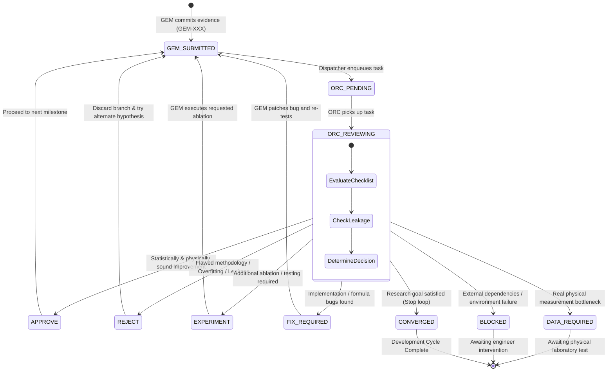

# GLIDE-SPEC-40 Agent Operational Contracts & State Machine

**Version:** 1.0.0  
**Effective Date:** 2026-09-13  
**Scope:** Formal Input/Output Contracts and State Transition Models between GEM and ORC

---

## 1. ORC Input Contract (Review Specification)

ORC가 GEM의 작업 결과(`EVIDENCE_REVIEW`)를 평가할 때 읽고 검토해야 하는 정규 입력 데이터셋입니다.

### 1.1 Mandatory Inputs
1. **Source GEM Commit:** 검토 대상 Git 커밋 ID (SHA) 및 커밋 메시지.
2. **Source Evidence File:** `analysis/commits/` 또는 `analysis/commits/dummy/` 에 저장된 증거 마크다운 문서.
3. **Commit Diff:** 해당 커밋에서 실제로 수정/추가된 코드 및 파일 변경분 (`git show <sha>`).
4. **Current Baseline Specification:** 공식 제품/연구 기준선 (`docs/REV8.1_BASELINE.md` 및 `REV7.3_DEVELOPMENT_BASELINE.md`).
5. **Relevant Benchmarks:** 벤치마크 규격 및 데이터셋 토폴로지 (`DATASET_FREEZE_1` vs `EXTERNAL_VALIDATION_SET_1`).
6. **Previous ORC Decision:** 직전 사이클의 ORC 결정 사항 및 요구 액션 (`analysis/commits/ORC-XXX*.md`).
7. **Current Project State:** `.agent/STATE.yaml` 및 `.agent/queue/ORC_QUEUE.md`.

### 1.2 Mandatory Inspection Checklist (10대 검증 사항)
ORC는 다음 항목을 독립 검증한 후 판정을 내려야 합니다:
- [ ] **Dataset Identity:** 학습용 동결 세트인가, 블라인드 검증 세트인가?
- [ ] **Baseline Integrity:** 공식 Rev.8.1 baseline 대비 정당한 비교인가?
- [ ] **Split & Holdout:** 엄격한 Holdout 또는 Group-CV 분할을 준수했는가?
- [ ] **Information Leakage:** Test 세트나 타겟 라벨 정보가 feature scaling/모델 선택에 누출되지 않았는가?
- [ ] **Benchmark Overfit:** 벤치마크 데이터에 하이퍼파라미터가 과적합되지 않았는가?
- [ ] **Cross-Domain Stability:** 다른 제형 도메인(고점도, 왁스계 등)에서도 안정성이 유지되는가?
- [ ] **Regression Check:** 기존 59개 테스트 및 과거 물리 특성에 성능 저하가 없는가?
- [ ] **Complexity vs Utility:** 아키텍처 복잡도 증가 대비 충분한 엔지니어링 가치가 있는가?
- [ ] **Manufacturing Relevance:** 배합, 유변물성, 도포(Payoff) 공정 실현 가능성이 있는가?
- [ ] **Physical Validation Need:** 코드 개선이 아닌 실측 제조 데이터가 병목인가 (`DATA_REQUIRED` 판단)?

---

## 2. ORC Output Contract (Decision Specification)

ORC의 검토 결과는 다음 표준 YAML 스키마로 구조화되어 `analysis/commits/ORC-XXX_DECISION.md` 파일에 기록되어야 합니다.

```yaml
ORC_ID: "ORC-002"
REF_GEM: "GEM-002"
STATUS: "COMPLETE"
DECISION: "REJECT" # [APPROVE | REJECT | HOLD | INVESTIGATE | EXPERIMENT | DATA_REQUIRED | FIX_REQUIRED | BLOCKED | CONVERGED]
RATIONALE: "Detailed scientific, statistical, or governance reason for decision"
REQUIRED_ACTIONS:
  - "Action item 1"
  - "Action item 2"
ACCEPTANCE_CRITERIA:
  - "Pass criterion 1"
EVIDENCE: "analysis/commits/dummy/GEM-002_DUMMY_EVIDENCE.md"
NEXT_AGENT: "GEM" # [GEM | HUMAN | STOP]
```

---

## 3. 에이전트 협업 상태 머신 (State Machine)

협업 주기는 다음의 엄격한 상태 전이(State Transition) 규칙을 따릅니다:



---

## 4. 작업 큐 스키마 (Queue Task Schema)

`.agent/queue/tasks/ORC-TASK-XXX.yaml` 형식:

```yaml
task_id: "ORC-TASK-002"
source_agent: "GEM"
source_id: "GEM-002"
source_commit: "c592056657fa02fc08760d9679bf3d94f4bb921a"
source_file: "analysis/commits/dummy/GEM-002_DUMMY_EVIDENCE.md"
task_type: "EVIDENCE_REVIEW"
status: "PENDING" # [PENDING | IN_PROGRESS | COMPLETED | SKIPPED]
created_at: "2026-09-13T11:45:00+09:00"
requires_orc: true
```
